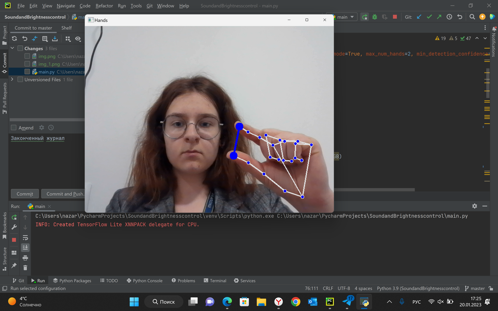
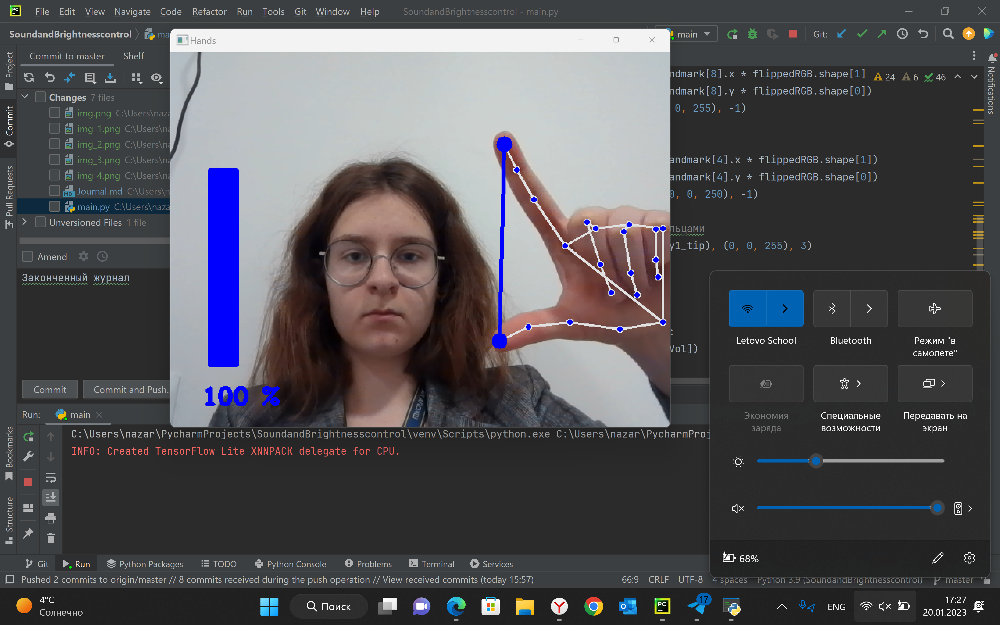
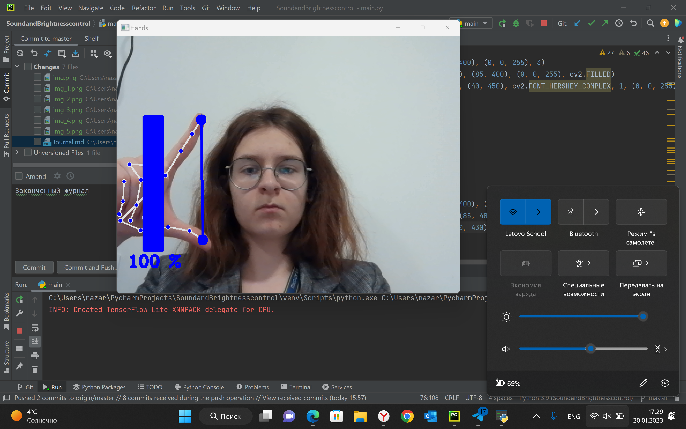
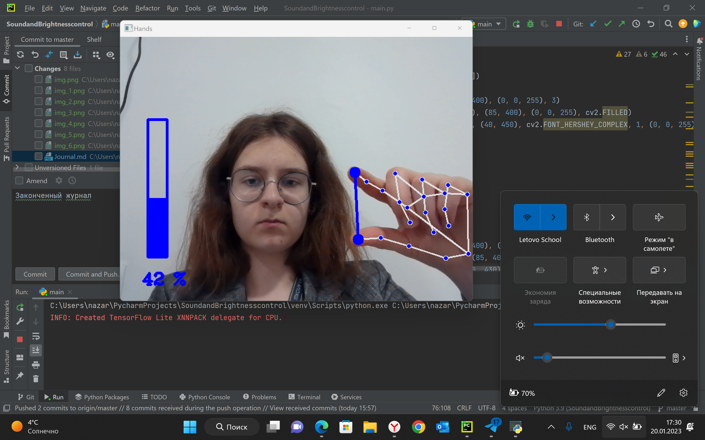

# Журнал проекта

1 День:
Я определилась с целью моего проекта и приступила к работе. Я создала часть кода, 
которая отвечает за распознание рук на изображении (также определение правая или левая рука). 
Затем я нарисовала круги на большом и указательном пальцах и соединила их линией, чтобы в 
дальнейшем понимать увеличивается или уменьшается расстояние между пальцами.

2 День:
Я научилась измеять длину линии, как длину вектора. После этого приступила к работе над
управлением уровня громкости. Я интерпретировала уровень громкости в длину линии между 
большим и указательным пальцами. Затем нарисовала прямоугольник, который отображает уровень
громкости в процентах.

3 День:
Закончив работу над громкостью, я приступила к управлению яркостью экрана. Для этого мне 
пришлось проделать похожую работу, интерпретировав уровень яркости в длину линии и нарисоваав
прямоугольник, показывающий уровень яркости в процентах.

4 День:
На данном этапе работы я столкнулась с тем, что процент, показываемый прямоугольником не всегда
совпадает с настоящим уровнем громкости и уровнем яркости. Я потратила около половины всего времени, 
потраченного на выполение проекта, на подбор параметров, которые исправили бы данную неточность. 
В результате, я полностью исправила неточности в отображении процентов яркости и добилась неплохих
результатов в отображении процентов громкости.

Итоги:
Цель проекта - управление уровнем громкости и уровнем яркости экрана с помощью жестов - была достигнута.
На проект ушло около 10 часов, а количество строк равно 85. Так получилось, потому что, как уже было 
сказано ранее, половина всего времени, требующегося для выполнения проекта, была потрачена на подбор 
параметров для отображения процентов (синий прямоугольник).

